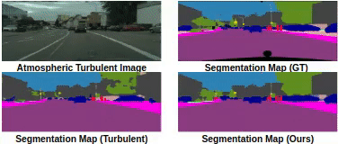

### Munich-to-Dubai: How far is it for Semantic Segmentation  [[pdf]](http://cvit.iiit.ac.in/images/ConferencePapers/2020/Munich2Dubai-wacv.pdf) 
#### Code is little messy will be cleaned and updated soon!!

### Requirements
* PyTorch (version = 0.3.0)
* Python (version = 2.7)
* Jupyter Notebook
* numpy
* tqdm
* torchvision ==0.2.0

### Usage
* Run the restoration notebook inside with the given parameters.
* Save the restored images after training.
* Use the restored images for further training the DeeplabV3 model along with coral loss.

### Results

